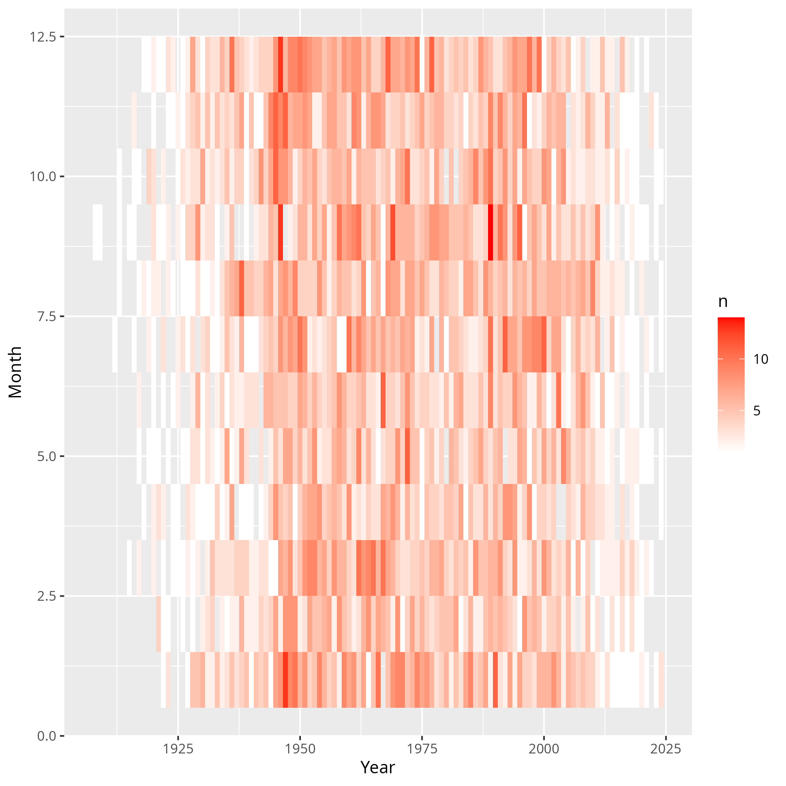
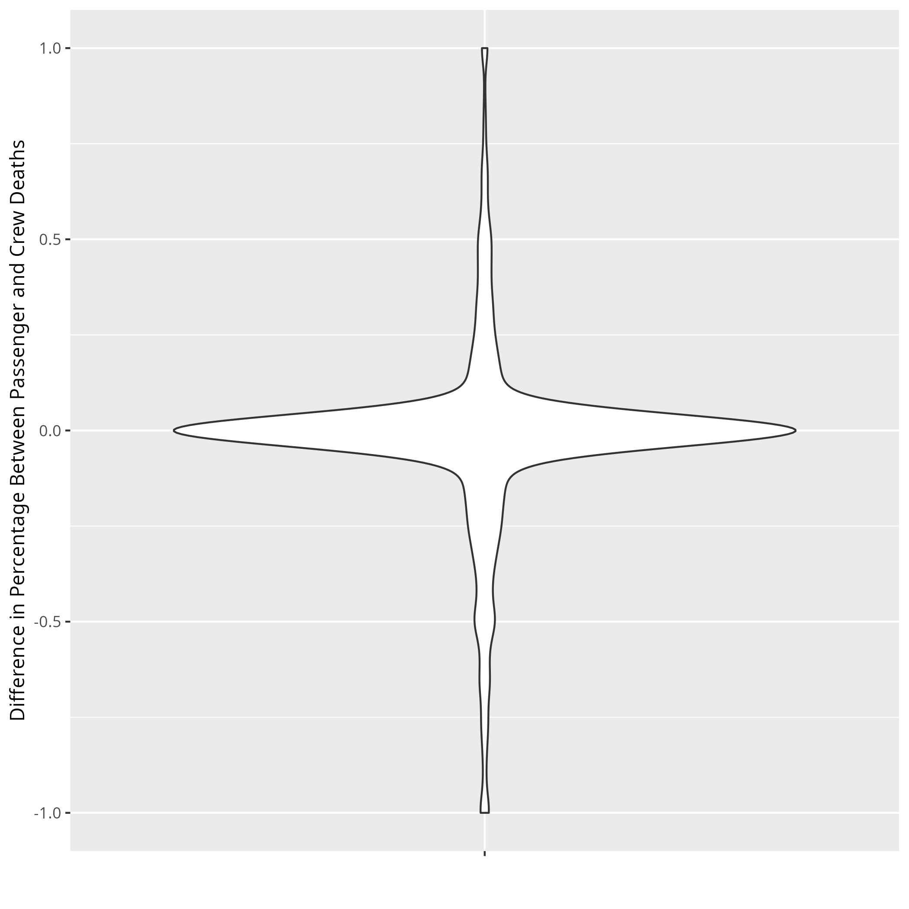

```{r include=FALSE}
knitr::opts_chunk$set(tidy.opts = list(width.cutoff = 40), tidy = TRUE, warning = FALSE, message = FALSE)
```

## Introduction

In this report, we will investigate trends about plane crashes, going back as early as 1908. Our dataset includes over 5,000 aviation accidents, including the most recent plane crashes from 2024. All data is scraped from [Plane Crash Info](https://www.planecrashinfo.com/), a website maintained by [Richard Kebabjian](mailto:kebab@planecrashinfo.com).

## Data Overview

As the [Plane Crash Info](https://www.planecrashinfo.com/) website states on its [database overview page](https://www.planecrashinfo.com/database.htm), this dataset includes all (or maybe most, according to the website's [disclaimer](https://www.planecrashinfo.com/disclaim.htm)) aviation accidents that meet the following criteria:^[The criteria in the report are copied from the Plane Crash Info [database overview page](https://www.planecrashinfo.com/database.htm)]

- All civil and commercial aviation accidents of scheduled and non-scheduled passenger airliners worldwide, which resulted in a fatality (including all U.S. Part 121 and Part 135 fatal accidents).

- All cargo, positioning, ferry and test flight fatal accidents.

- All military transport accidents with 10 or more fatalities.

- All commercial and military helicopter accidents with greater than 10 fatalities.

- All civil and military airship accidents involving fatalities.

- Aviation accidents involving the death of famous people.

- Aviation accidents or incidents of noteworthy interest.

[Plane Crash Info](https://www.planecrashinfo.com/) includes information, if known, for the date and time of the accident, the airline/operator and the flight number, the route, aircraft type and other specifics (such as serial number), the total number aboard and fatalities, broken up by passengers and crew, total killed on the ground, and a text description of the accident. Not all of these values are full for all rows, but the dataset is reasonably extensive.

## Data Preparation

We scraped all data available from the database into a clean dataframe. Our scraping function first calculates all subfiles in the database, and then concatenates the results from each page together into one dataframe. We also cached each page to ensure we would not need to unnecessarily run the scraping calls. This data is now available in the project repository, under the `data` folder.

After we saved the data from [Plane Crash Info](https://www.planecrashinfo.com/), we cleaned the data to ensure we could accurately investigate the information. First, we ran a drop duplicate command to ensure each row was unique, although there were no duplicate rows.

We then completed a series of formatting steps. We ensured that both dates and times were standardized and recognizable as such by `tidyverse`. We made sure times were in 24 hour form.^[All times are local to the crash, as specified in the [database overview page](https://www.planecrashinfo.com/database.htm)] We also split the aboard and fatality columns into total, passengers, and crew. Finally, we ran queries through the `ArcGIS API` for each location description. Nearly all locations returned latitude and longitude points, but for those that did not, we cleaned the names of descriptors like "near" and re-ran the queries. When all queries finished, only twelve filled locations failed to include latitude and longitude marks. These twelve descriptions that did not find a latitude and longitude match are since-renamed parts of the former USSR. The cleaned dataset is available in the `cleaned_data` folder.

## Findings

### Crashes Over Time

To begin our investigation, it makes sense to look at the trend of plane crashes over time. It seems to be a reasonable assumption that crashes have decreased, but we will need to see the specific information to confirm. Since there are not that many crashes overall, we will aggregate by year.

```{r, echo=FALSE, fig.cap="Number of Fatal Plane Crashes by Year", out.width = '100%', fig.pos="H"}
knitr::include_graphics("figures/num_crashes_by_year.png")
```

When we aggregate by year, we can see that there was a steep increase in fatal airplane crashes up until the 1950s. Part of this increase is likely due to a few things, including the increasing prevalence of plane travel over the 1900s and the two world wars, which involved heavy air fights. Interestingly, we see that from about 1945 the late 1990s, there were consistently higher numbers of plane crashes per year, even though the number was decreasing slightly overall. Then, around the 2000s, the number of fatal plane crashes steeply decreased, to nearly the same levels as the early 1900s. It certainly appears to confirm our intuition that plane travel has always been relatively safe, and is certainly even more safe now than it ever has been before.

However, it is possible that aggregating up by year could hide important trends. Thus, we can also look at a heatmap of the number of crashes by month over the entire time period in the dataset.

```{r, echo=FALSE, fig.cap="Fatal Plane Crashes By Month, Over Time", out.width = '100%', fig.pos="H"}

```

As we saw before, the bars at each edge, representing the beginning and most recent months, have the fewest fatal crashes, with many having zero or one. Beyond this overall pattern, there does not seem to be a strong trend in the figure, beyond the years in the middle having more crashes, which we saw before. Perhaps January and December have more crashes, but there are not many strong monthly patterns.

### Fatality Rates

In addition to the overall crash numbers, the dataset contains information about the total number of people onboard, broken into crew and passenger when possible, as well as the number of fatalities, also broken into crew and passenger when available. We can look into the death rate overall, as well as for crew and passengers.

```{r, echo=FALSE, fig.cap="Violin Plots for Percentage of Fatalities by Crew and Passenger", out.width = '100%', fig.pos="H"}

```

When we look at the violin plots, it is clear that most crashes in our dataset have a complete fatality rate, with the majority of the other instances at above a 50% fatality rate. The most interesting trend in the graph appears to be that crew have a slightly higher fatality rate than passengers. 

We can, therefore, look at the difference in fatality rates between crews and passengers for the same crashes. There are some planes with no passengers, but there are never planes without a crew, so we should expect some rates to be negative solely due to this reality. 

```{r, echo=FALSE, fig.cap="Difference in the Percentage of Passenger and Crew Deaths", out.width = '100%', fig.pos="H"}

```

Perhaps unsurprisingly, most crashes have the same death rate between crew and passengers, which makes sense when there are no survivors. Crew do seem to die slightly more when there are survivors, but this difference is quite small, as most of the data for planes that had survivors is relatively evenly spread around the 0 axis. Thus, when there are survivors, there is not a major difference in survival rates between crew and passengers.

### Fatalities on the Ground

The dataset also includes statistics about the number of people killed on the ground when the plane crashed.

```{r, echo=FALSE, fig.cap="Number Killed on the Ground over Time", out.width = '100%', fig.pos="H"}
knitr::include_graphics("figures/number_killed_ground_plot.png")
```

Looking at this graph, it is clear that most plane crashes kill zero or few people on the ground. However, the 9-11 attacks stand out as the worst case of non-flight deaths, with more than 2,500 casualties on the ground. This graph makes it clear just how unique these attacks are for the entire history of fatal flights.

### Operators with the Most Crashes

We also have information in the dataset about the operator of the plane. If we aggregate by decade, we can investigate the most fatal operators by decade.

```{r, echo=FALSE, fig.cap="Airplane Operator with Most Accidents by Decade", out.width = '100%', fig.pos="H"}

```

Perhaps unsurprisingly, during the world wars, the U.S. and German militaries had the most crashes. The U.S. Aerial Mail Service had the most crashes in the 1920s, which is surprising. Additionally, Russian airline service Aeroflot had the most crashes in the 1960s-1990s, dominating the number of fatal flights during these decades. Aeroflot is still in operation today, but it does not seem to have had a propensity for crashes after the 1990s.

For the 2000s, 2010s, and 2020s, there have been so few crashes that multiple operators have ties for the most fatal flights. In fact, the 2020s have only had one crash per operator, so we removed this column from the plot. As we discussed in the aforementioned plot of people killed on the ground, the fact that American Airlines appears in 2000 is due to the September 11 attacks.

### Crash Locations over Time

After our transformations of the original dataset, we have latitude and longitude-specific locations for all crashes with location information except twelve. We split the crashes by decade and plotted the crash locations on maps.

```{r, echo=FALSE, fig.cap="Locations of Airline Crashes", out.width = '100%', fig.pos="H"}
knitr::include_graphics("figures/map_crashes.png")
```

One clear pattern is that air crashes originally only occurred in certain parts of the U.S. and Europe. With air travel being relatively rare, as well as World War I in the 1910s, it is unsurprising that all crashes would be related to early aviation in the U.S. and warfare. 

In the remaining decades, a surprising trend seems to be that most crashes occur either over land or very close to land, with very few in the ocean. As many stories about plane crashes focus on ocean landings, our assumption would be that many crashes occurred over water. This does not appear to be true. Additionally, much of our news coverage of plane crashes in the modern era focus on civilian planes being shot down over war zones, such as Syria or Russia/Ukraine. However, plane crashes are widely distributed over time around the entire world. Most crashes appear near coasts, but it could be that plane crashes more often occur near major mountain ranges than any other geographical feature.

### Crash Description Analysis

In addition to these descriptive statistic plots, we wanted to try dimensionality reduction. The dataset comes with brief, written descriptions of each plane crash in English. We used `NLTK` to remove stopwords and tokenize each word. We then turned each description into a vector, representing words available in the texts, leaving only more common words. The full dataset of vectors is in the `cleaned_data` folder, called `plane_description_counts.csv`. 

We then conducted Principal Component Analysis (PCA) on these vectors, hoping to see clustering for different types of crashes. PCA is a method to reduce high dimensionality data into principal components, or the mathematical vectors which best represent the most information in the dataset. We will look at the first two components, which contain the best representation of our text vectors in two dimensions.

```{r, echo=FALSE, fig.cap="First Two Principle Components for Plane Crash Descriptions", out.width = '100%', fig.pos="H"}
knitr::include_graphics("figures/pca_decade.png")
```

This dimensionality reduction did not cluster the data in meaningful ways, and decade is certainly not what this PCA is representing. The other variables we could look at, such as the operator, would be difficult to show in a static plot such as this, so it is not clear exactly why this clustering is occurring. However, this plot may show that this dataset is most interesting from an exploratory data analysis standpoint rather than any dimensionality reduction or modeling lens.

## Conclusions

The Plane Crash dataset from [Plane Crash Info](https://www.planecrashinfo.com/) contains data full of interesting observations for anyone curious about the history of fatal plane crashes. The reality is that planes are exceptionally safe, as there are only about 5,000 entries from 1908 to today. Even in the worst years for crashes, the 1950s-1990s, there were only about 80 crashes per year. With millions of flights around the world yearly, planes are much safer than other common transportation methods, including car travel.

However, the prevalence of fear surrounding aviation may be due to the fact that most plane crashes have few or no survivors, even as plane travel has gotten much safer recently. Additionally, in part because crashes are so rare, newspapers report stories of fatal plane crashes as headline news. This reporting can cause misconceptions, such as that plane crashes are common, often over water, or that a certain carrier, such as Boeing in the last year, is more deadly. In reality, plane travel is safe, planes most often crash near or over land, and even with the recent Boeing incidents, Boeing is no more dangerous than any other carrier. Other misconceptions such as these can be disproven when looking at the data itself.

### Future Work 

This dataset would likely be best represented in an interactive setting, such as a `d3`-driven website. The data, although it includes relatively few columns, has many high-dimensional variables that are difficult to represent in any static form. In the future, we would be interested in investigating the trend of certain operators with the descriptions of the crashes, using techniques like PCA and interactive visualizations. Additionally, separating the dataset into military versus commercial versus personal crashes could give further insight into the reasons planes crashed in the past.