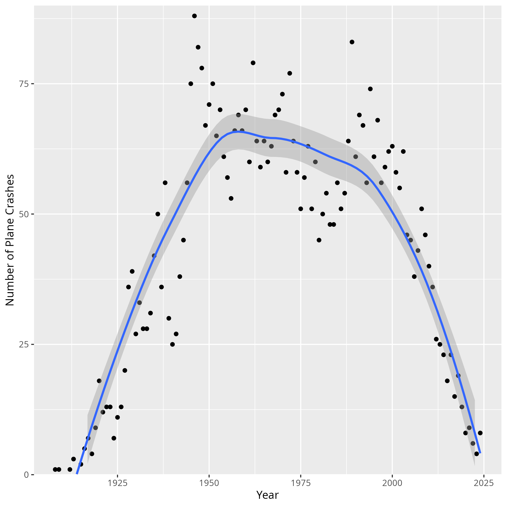

```{r include=FALSE}
knitr::opts_chunk$set(tidy.opts = list(width.cutoff = 40), tidy = TRUE, warning = FALSE, message = FALSE)
```

## Introduction

In this report, we will investigate trends about plane crashes, going back as early as 1908. Our dataset includes over 5,000 aviation accidents, including the most recent plane crashes from 2024. All data is scraped from [Plane Crash Info](https://www.planecrashinfo.com/), a website maintained by [Richard Kebabjian](mailto:kebab@planecrashinfo.com).

## Data Overview

As the [Plane Crash Info](https://www.planecrashinfo.com/) website states on its [database overview page](https://www.planecrashinfo.com/database.htm), this dataset includes all (or maybe most, according to the website's [disclaimer](https://www.planecrashinfo.com/disclaim.htm)) aviation accidents that meet the following criteria:^[The criteria in the report are copied from the Plane Crash Info [database overview page](https://www.planecrashinfo.com/database.htm)]

- All civil and commercial aviation accidents of scheduled and non-scheduled passenger airliners worldwide, which resulted in a fatality (including all U.S. Part 121 and Part 135 fatal accidents)

- All cargo, positioning, ferry and test flight fatal accidents.

- All military transport accidents with 10 or more fatalities.

- All commercial and military helicopter accidents with greater than 10 fatalities.

- All civil and military airship accidents involving fatalities.

- Aviation accidents involving the death of famous people.

- Aviation accidents or incidents of noteworthy interest.

[Plane Crash Info](https://www.planecrashinfo.com/) includes information, if known, for the date and time of the accident, the airline/operator and the flight number, the route, aircraft type and other specifics (such as serial number), the total number aboard and fatalities, broken up by passengers and crew, total killed on the ground, and a text description of the accident. Not all of these values are full for all rows, but the dataset is reasonably extensive.

## Data Preparation

We scraped all data available from the database into a clean dataframe. Our scraping function first calculates all subfiles in the database, and then concatenates the results from each page together into one dataframe. We also cached each page to ensure we would not need to unnecessarily run the scraping calls. This data is now available in the project repository, under the `data` folder.

After we saved the data from [Plane Crash Info](https://www.planecrashinfo.com/), we cleaned the data to ensure we could accurately investigate the information. First, we ran a drop duplicate command to ensure each row was unique, although there were no duplicate rows.

We then completed a series of formatting steps. We ensured that both dates and times were standardized and recognizable as such by `tidyverse`. We made sure times were in 24 hour form.^[All times are local to the crash, as specified in the [database overview page](https://www.planecrashinfo.com/database.htm)] We also split the aboard and fatality columns into total, passengers, and crew. Finally, we ran queries through the `ArcGIS API` for each location description. Nearly all locations returned latitude and longitude points, but for those that did not, we cleaned the names of descriptors like "near" and re-ran the queries. When all queries finished, only twelve filled locations failed to include latitude and longitude marks. These twelve descriptions that did not find a latitude and longitude match are since-renamed parts of the former USSR. The cleaned dataset is available in the `cleaned_data` folder.

## Findings

To begin our investigation, it makes sense to look at the trend of plane crashes over time. It may be a reasonable assumption that planes have become safer, but we can look at what the data shows us. Since there are not that many crashes overall, we will aggregate by year.




